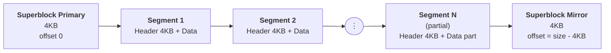
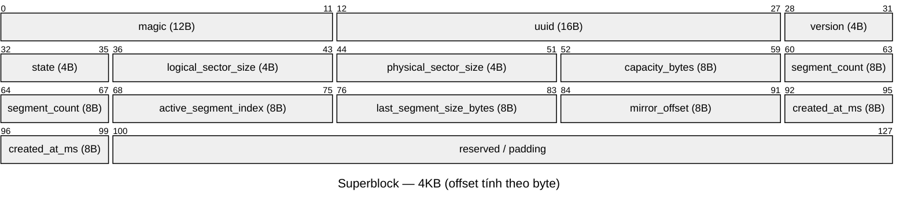
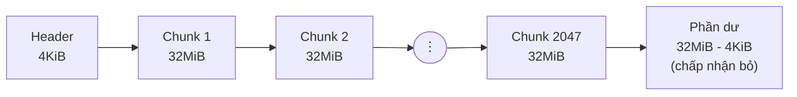
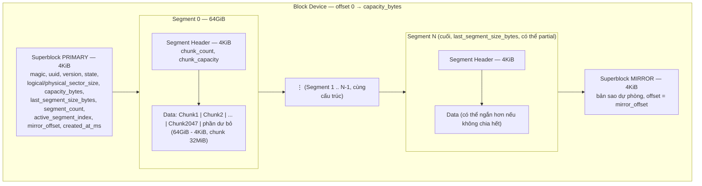

# Sơ Đồ Cấu Trúc On-Disk Format — `quick_format`

## 1. Tổng quan layout

Toàn bộ block device được chia thành: **Superblock chính**, các **Segment** dữ liệu, và **Superblock mirror** (dự phòng cuối thiết bị).

- **Superblock (Primary)**: offset `0`, kích thước cố định `4KB`.
- **Superblock (Mirror)**: offset `size_of_device - 4KB`, bản sao dự phòng để phục hồi khi superblock chính hỏng.
- **Segment**: đơn vị cấp phát lớn, mỗi segment có **Header riêng (4KB)** + vùng **Data**.
- Segment cuối cùng có thể không đầy (`partial segment`) nếu dung lượng thiết bị không chia hết.

---

## 2. Cấu trúc Superblock (4KB)

> Tổng các field = 92 byte; phần `reserved / padding` trên sơ đồ chỉ vẽ tượng trưng, thực tế đệm liên tục từ offset 92 đến hết 4095 (4KB).

| Field | Kiểu Rust | Size | Mô tả |
|---|---|---|---|
| magic | `[u8; 12]` | 12 bytes | Magic number nhận diện định dạng |
| uuid | `[u8; 16]` | 16 bytes | Định danh duy nhất của volume |
| version | `u32` | 4 bytes | Version format |
| state | `StorageState` | 4 bytes | Trạng thái storage (enum, repr u32) |
| logical_sector_size | `u32` | 4 bytes | Kích thước logical sector |
| physical_sector_size | `u32` | 4 bytes | Kích thước physical sector |
| capacity_bytes | `u64` | 8 bytes | Tổng dung lượng thiết bị (bytes) |
| last_segment_size_bytes | `u64` | 8 bytes | Kích thước segment cuối (có thể partial) |
| segment_count | `u64` | 8 bytes | Số lượng segment |
| active_segment_index | `u64` | 8 bytes | Index của segment đang active |
| mirror_offset | `u64` | 8 bytes | Offset của superblock mirror |
| created_at_ms | `u64` | 8 bytes | Timestamp tạo (millisecond epoch) |
| reserved | — | padding | Đệm cho đủ 4KB |

> Superblock Primary và Mirror phải **đồng nhất nội dung** (trừ khi đang trong quá trình ghi transaction); khi mount, hệ thống so sánh `magic` + `version` của cả hai để chọn bản hợp lệ.

---

## 3. Cấu trúc Segment
 
- Mỗi **segment = 64GiB**.
- Trong segment gồm: **Header 4KiB** + vùng **Data** chứa các **chunk**, mỗi chunk **32MiB**.
- Số chunk trong 1 segment (phần Data) = `(64GiB - 4KiB) / 32MiB` ≈ **2047 chunk** (còn dư một phần nhỏ **32MiB - 4KiB**, chấp nhận bỏ vì không đủ 1 chunk).
 

### 3.1 Segment Header (4KiB)
 

 
> Tổng field = 16 byte; phần `reserved / padding` chỉ vẽ tượng trưng, thực tế đệm liên tục tới hết offset 4095 (4KiB).
 
| Field | Kiểu Rust | Size | Mô tả |
|---|---|---|---|
| chunk_count | `u64` | 8 bytes | Số lượng chunk trong segment, đồng thời là index cho lần ghi kế tiếp |
| chunk_capacity | `u64` | 8 bytes | Sức chứa (kích thước) của mỗi chunk |
| reserved | — | padding | Đệm cho đủ 4KiB |

---

## 4. Sơ đồ tổng hợp (chi tiết, dạng phân cấp)

---

## 5. Ghi chú thiết kế

- **Fixed-point layout**: `segment_count`, offset từng segment và vị trí mirror superblock được tính cố định 1 lần khi format, không cần bảng chỉ mục động → tra cứu offset bằng công thức `O(1)`.
- **CRC32C**: áp dụng cho cả Superblock và Segment Header để phát hiện corruption sớm khi mount.
- **Dual superblock**: nếu Primary hỏng (checksum sai), fallback đọc Mirror ở cuối device để phục hồi.
- **flock**: tiến trình mount cần giữ exclusive lock (`flock`) trên block device để tránh 2 tiến trình ghi đồng thời.
- **Partial segment cuối**: nếu `device_size` không chia hết cho `segment_size`, segment cuối vẫn có Header đầy đủ 4KB nhưng vùng Data bị cắt ngắn theo dung lượng còn lại.

---

*File này mô tả layout tổng quát dựa trên thiết kế hiện tại của `quick_format`. Điều chỉnh lại field/size cho khớp với struct thực tế trong code Rust nếu có sai lệch.*