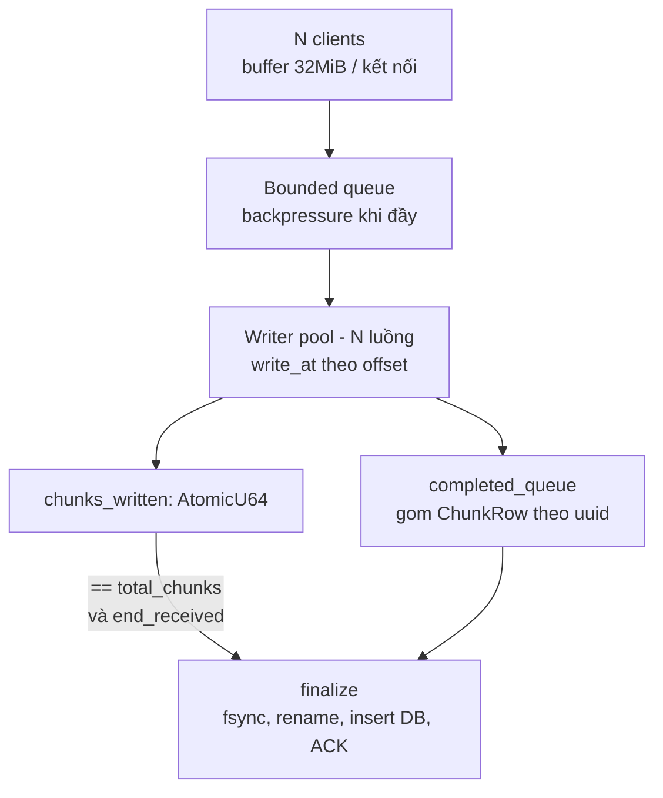

# Disk Writer Plan — streaming file lớn qua TCP vào server2

## 1. Bối cảnh & mục tiêu

Pipeline tổng thể:

```
client (gửi file 5GB qua HTTP) --> server (TCP) --> forward --> server2
```

Server nội bộ có 3 kênh khả dụng: TCP, HTTP, WS. CLI (`server2 start ./larger-file.db`) dùng kênh **TCP**.

Ràng buộc chính:
- File có thể vài GB — không thể buffer toàn bộ vào RAM.
- Nhiều client (N) đẩy dữ liệu đồng thời.
- Cần biết chắc chắn server đã nhận **đúng** dữ liệu, không chỉ dựa vào việc TCP đóng kết nối (FIN/RST không phân biệt được "xong việc" và "lỗi giữa chừng").

## 2. Vì sao chọn TCP thay vì HTTP/WS cho kênh này

| Kênh | Ưu | Nhược |
|---|---|---|
| Raw TCP | Overhead thấp nhất | Phải tự viết toàn bộ framing/retry/integrity |
| HTTP | Có sẵn `Content-Length`/chunked, status code, dễ debug | Overhead cao hơn (không đáng kể trong mạng nội bộ) |
| WebSocket | Full-duplex, có framing sẵn | Chỉ lợi khi cần tương tác 2 chiều liên tục; forward file 1 chiều thì không hơn HTTP |

CLI đã chốt dùng TCP raw, chấp nhận đánh đổi tự viết framing để đổi lấy overhead thấp nhất.

## 3. Giao thức framing trên TCP

TCP là stream byte thuần túy, không có khái niệm ranh giới message — bắt buộc phải tự định nghĩa framing (length-prefixed / TLV), tương tự nguyên lý HTTP chunked encoding hay Protobuf delimited I/O.

**Header cố định (binary):**

```
[msg_type: 1 byte][payload_len: 4 bytes u32 BE][payload: payload_len bytes]
```

| msg_type | Ý nghĩa |
|---|---|
| `0x01` INFO | filename, total_size |
| `0x02` DATA | raw bytes, ≤ 32MiB, không cần header lặp ở mỗi chunk ngoài `payload_len` |
| `0x03` END | báo hết stream, kèm hash cuối để verify toàn vẹn |
| `0x04` ACK/ERROR | phản hồi từ server2 |

**Bắt buộc đọc/ghi đủ byte, không giả định 1 lần syscall là đủ:**
- `recv()`/`read()` một lần **không** đảm bảo đủ payload đã khai báo — phải dùng `read_exact` (đọc đủ N byte header trước, parse `payload_len`, rồi đọc đủ đúng số byte đó).
- `write()` có thể ghi thiếu (short write) — phải dùng `write_all`.

**TCP đóng kết nối không phải tiêu chí thành công.** Chỉ dùng để phát hiện lỗi sớm (đứt mạng giữa chừng). Xác nhận "đã nhận đúng" phải đến từ ACK tường minh sau khi verify hash ở msg END.

## 4. Chiến lược ghi disk

- Chunk DATA 32MiB = đơn vị ghi disk luôn, không chia thêm 1 lần nữa.
- Nhận INFO → `fallocate`/preallocate file theo `total_size`, mở file tạm `<filename>.part`.
- Ghi bằng **positioned write** (`write_at`/pwrite), **không** dùng `write()` nối tiếp:

```rust
let offset = chunk_index as u64 * CHUNK_SIZE;
file.write_at(&buf[..len], offset)?;
```

  → đảm bảo đúng vị trí byte bất kể N writer thread xử lý chunk không theo thứ tự tới.
- `fsync` chỉ gọi **1 lần duy nhất** lúc finalize, không fsync mỗi chunk (mỗi fsync là 1 lần flush thật xuống đĩa, gọi hàng trăm lần sẽ giết throughput).
- Sau fsync: `rename` atomic `.part` → tên file cuối. Nếu crash giữa chừng, file `.part` dở dang không bị nhầm là file hoàn chỉnh.

## 5. Kiến trúc xử lý N client đồng thời



- Buffer 32MiB/kết nối nên **tái sử dụng qua pool**, không cấp phát mới mỗi chunk — với N kết nối lớn, alloc/dealloc liên tục sẽ tốn overhead đáng kể.
- Queue giữa connection reader và writer pool phải **bounded** (`tokio::sync::mpsc::channel(capacity)`), không unbounded. Khi đầy, task đọc từ 1 connection cụ thể `.await` tại `send()` → TCP recv buffer phía đó đầy dần → flow control tự làm chậm client đó, không ảnh hưởng client khác.
- RAM tối đa ≈ (số connection đang fill buffer × 32MiB) + (queue capacity × 32MiB).

## 6. Phát hiện hoàn tất (completion detection)

**Đã cân nhắc và loại bỏ 2 phương án:**

| Phương án | Lý do loại bỏ |
|---|---|
| Poll "queue pending write" xem còn uuid hay không | Mơ hồ ở thời điểm entry bị xoá (lúc dequeue để xử lý hay lúc ghi xong?) — nếu là lúc dequeue thì có race: worker vừa lấy job, chưa ghi xong, nhưng đã bị coi là "không còn trong queue" |
| Job quét định kỳ (5 phút) để check completed_queue đã đủ chưa | Không liên quan tới việc gửi ACK cho client (đã làm rõ), nhưng nếu dùng cho *cả* completion detection thì gây độ trễ không cần thiết và không scale khi số queue tăng theo thời gian |

**Cơ chế chốt: atomic counter, event-driven, không polling.**

```rust
struct UploadState {
    total_chunks: u64,             // tính ngay từ total_size trong msg INFO
    chunks_written: AtomicU64,
    end_received: AtomicBool,
}
// uploads: DashMap<Uuid, Arc<UploadState>>
```

Writer thread, ngay sau khi `write_at()` thành công:

```rust
completed_queue.push(uuid, ChunkRow { segment_index, chunk_index, disk_number, offset, len });

let done = state.chunks_written.fetch_add(1, Ordering::SeqCst) + 1;
if done == state.total_chunks && state.end_received.load(Ordering::SeqCst) {
    // fetch_add trả giá trị duy nhất mỗi lần gọi
    // -> chỉ đúng 1 thread rơi vào nhánh này, không cần lock/cờ phụ để tránh double-fire
    finalize(uuid).await;
}
```

**Race cần xử lý:** writer có thể chạm `done == total_chunks` **trước khi** `end_received` được set (msg END tới trễ hơn chunk cuối). Connection handler, ngay sau khi đọc xong msg END, phải tự kiểm tra lại điều kiện và gọi `finalize()` nếu writer chưa kịp trigger — `finalize()`/`uploads.remove()` phải **idempotent** để 2 phía cùng gọi không gây lỗi.

## 7. Vai trò của msg END

Sau khi tách completion detection ra khỏi END, vai trò của END thay đổi:
- **Không** dùng để đếm/xác nhận đã nhận đủ chunk (counter đã lo việc này).
- Chỉ còn mang **hash cuối** để verify tính toàn vẹn dữ liệu — trả lời đúng câu hỏi gốc: "server có nhận đúng không" tách biệt khỏi "server đã nhận đủ byte chưa".

## 8. Ghi metadata vào SQLite

- `completed_queue` gom `ChunkRow (uuid, segment_index, chunk_index, disk_number, offset, len)` ngay lúc mỗi chunk ghi xong disk — giữ nguyên ý tưởng ban đầu, có giá trị giảm round-trip DB khi insert 1 lần thay vì insert lẻ tẻ từng dòng.
- **Bỏ hẳn job batch định kỳ.** Ngay trong `finalize()`, đẩy thẳng `rows` vào 1 SQLite writer task riêng:

```rust
if done == state.total_chunks && state.end_received.load(Ordering::SeqCst) {
    let rows = drain_completed_queue_for(uuid);
    fsync(&file)?;
    rename(tmp_path, final_path)?;
    sqlite_writer_tx.send(WriteJob { uuid, rows }).await?;
    ack_tx_for(uuid).send(FinalizeResult::Ok).ok();
    uploads.remove(&uuid);
}
```

- SQLite writer task: **single writer** (tránh tranh writer lock giữa nhiều `finalize()` chạy song song), dùng pattern `mpsc` + `spawn_blocking` cho Rusqlite đã dùng ở nơi khác trong hệ thống. Tự batch theo tải thực tế — rút hết những gì có sẵn trong channel tại thời điểm xử lý, gộp vào 1 transaction:

```rust
loop {
    let job = sqlite_rx.recv().await;
    let mut jobs = vec![job];
    while let Ok(j) = sqlite_rx.try_recv() { jobs.push(j); }
    spawn_blocking(move || {
        let tx = conn.transaction()?;
        for j in &jobs { for row in &j.rows { tx.execute(INSERT_CHUNK, row)?; } }
        tx.commit()
    }).await??;
}
```

- **WAL mode chỉ bảo vệ transaction đã COMMIT tới SQLite.** Nó không bảo vệ dữ liệu còn nằm trong `completed_queue` (RAM) *trước khi* được gửi qua channel — nếu crash xảy ra ở khoảng đó, SQLite chưa từng nhận dữ liệu nên không có gì để WAL replay. Insert ngay trong `finalize()` (thay vì đợi job 5 phút) thu hẹp khoảng gap này gần về 0, nhưng không triệt tiêu hoàn toàn — xem mục 10.

## 9. ACK về client

- Mỗi `UploadState` giữ thêm 1 `oneshot::Sender` được connection handler tạo lúc nhận INFO.
- `finalize()` — dù được trigger từ writer thread hay từ connection handler — gửi kết quả qua oneshot này.
- Connection handler, sau khi đọc xong msg END, `await` trên `oneshot::Receiver` rồi mới gửi ACK cuối cho client — đúng lúc nào finalize xong thì ACK mới đi, không phụ thuộc thứ tự END đến trước hay sau khi ghi xong.

## 10. Quyết định & đánh đổi

| Quyết định | Vì sao | Đánh đổi chấp nhận |
|---|---|---|
| TCP raw thay vì HTTP/WS cho kênh CLI | Overhead thấp nhất trong 3 kênh nội bộ | Tự viết toàn bộ framing, backpressure, retry |
| Framing tự chế (length-prefix) thay vì gRPC | Phù hợp cách làm hiện tại, không thêm dependency | Tốn công hơn nhưng kiểm soát toàn quyền |
| `write_at` theo offset thay vì `write()` nối tiếp | Loại bỏ phụ thuộc thứ tự xử lý của N writer thread | Cần preallocate file trước khi ghi |
| Atomic counter thay vì polling/job định kỳ | Phát hiện tức thời, O(1), không cần lock | Phải tính đúng `total_chunks` ngay từ msg INFO |
| Insert DB ngay trong `finalize()` thay vì batch theo interval | Thu hẹp gap mất dữ liệu khi crash gần về 0; tự batch theo tải thực tế qua channel | Vẫn còn 1 khoảng gap rất nhỏ giữa lúc ghi disk xong và lúc gửi vào SQLite channel (mục 8) |

## 11. Câu hỏi còn mở — chưa chốt

1. **`disk_number` trong `ChunkRow`** — có đang định striping chunk qua nhiều đĩa vật lý không (giống Segment Allocation trong `quick_format`)? Nếu có, cần 1 hàm map `chunk_index -> (disk_number, local_offset)` tách biệt khỏi offset file logic toàn cục, ảnh hưởng trực tiếp cách tính offset ở mục 4. Nếu không, có thể bỏ field này.
2. **`chunk_info` có tự mô tả được trên đĩa** (đọc lại header từng chunk để rebuild nếu mất record) hay DB là nguồn duy nhất giữ mapping? Quyết định này ảnh hưởng tới việc có cần thêm WAL/log riêng cho `completed_queue` để đóng nốt gap còn lại ở mục 8, hay chấp nhận rủi ro (rất nhỏ) mất record khi crash đúng lúc.
3. **Retry/resume khi client mất kết nối giữa chừng** — chưa thảo luận trong thiết kế này, cần xác định: server2 có giữ lại phần đã nhận (`.part` + `chunks_written` hiện tại) để client resume từ chunk còn thiếu, hay yêu cầu gửi lại từ đầu.